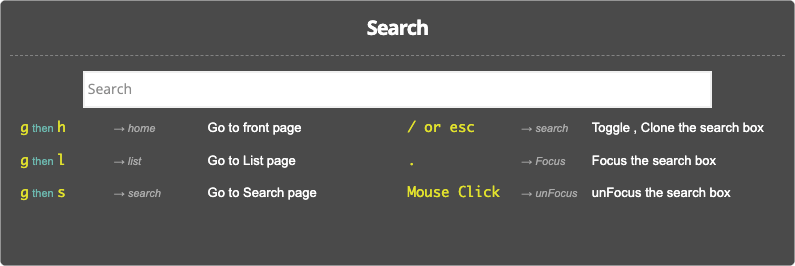

# 検索ウィンドウをキーボード操作でPOPアップ

WordPress の野良プラグインです。プラグイン名称は、`Keyboard PopUP algolia search` です。
キーボード操作でポップアップする検索ウィンドウです。algolia検索と組み合わせて使うために、改造しました。元ソースは、wp-keyboard-nav [LINK](https://github.com/tareq1988/wp-keyboard-nav) というプラグインです。

## Screenshots

## Shortcuts
- `/` → 検索ウィンドウが開きます
- `.` → 検索テキストボックスにフォーカスを移します
- `ESC` → サーチボックスを閉じます

- `g` then `h` → WordPress の `HOME URL` に飛びます
- `g` then `l` → `/list/` のslug ページに飛びます
- `g` then `s` → `/s/` のslug ページに飛びます。

## Extend

algolia検索 のWordPressプラグイン「WP Search with Algolia」[LINK](https://ja.wordpress.org/plugins/wp-search-with-algolia/)　と組み合わせて使うと、以下のように利用できます。どのように動作するかのサンプル確認用として載せておきます。

* https://hack.gpl.jp/

これは静的ページのサイトですが、WordPress サイトでも動作します。